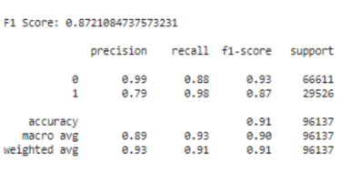
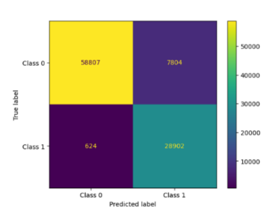
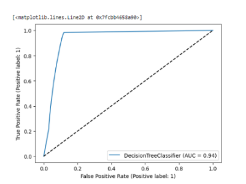

# LOAN PREDICTION
## INTRODUCTION
Loans are a key building block of the financial system and are crucial for fostering economic expansion. Financial firms may manage risk and make sure they are lending to creditworthy borrowers by accurately estimating the possibility of default or repayment. This in turn may enhance financial system stability and economic expansion. By studying loan default we can understand how it affects the economy, lenders can assess risk,investment decisions and the likelihood of consumers falling into debt traps.
## OUTPUT
 

   
  F1 SCORE

 

   
  Prediction Matrix

 

   
  AUC

The area under the curve will range from 50 percent, for a worthless model, to 100 percent for a perfect classifier. Points closer to the upper-right corner correspond to low cutoff probabilities, whereas points in the lower left correspond to higher cutoff probabilities. The extreme points (1, 1) and (0, 0) represent no-data rules where all cases are classified into bankrupt or non-bankrupt, respectively. It seems obvious that applicants with higher incomes and smaller loan requests are more likely to be accepted because they are more likely to pay back their obligations. Other aspects, such gender and marital status, don't seem to be taken into account by the company. This forecasting module should be improved in the future, and integrated. The system is trained using prior training data, but it is feasible to alter the software in the future so that it may accept new testing data as well as training data and predict as necessary.